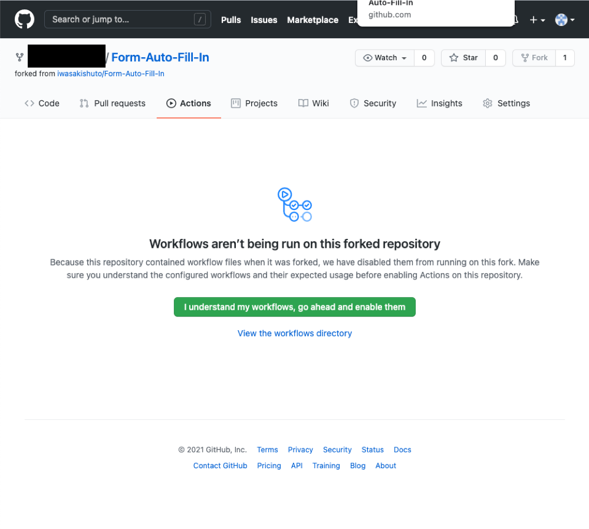
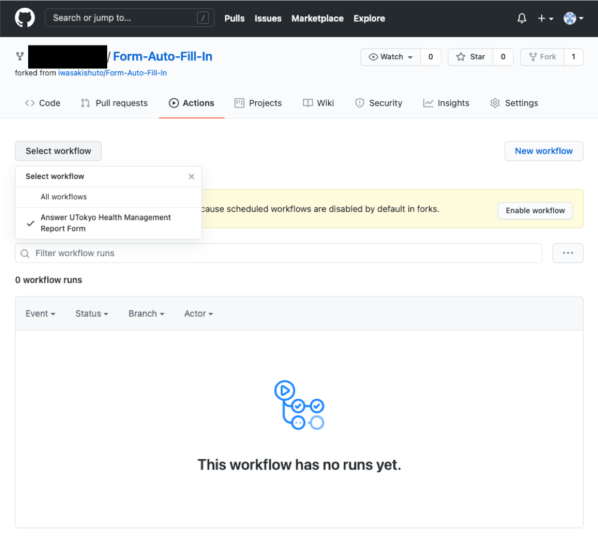
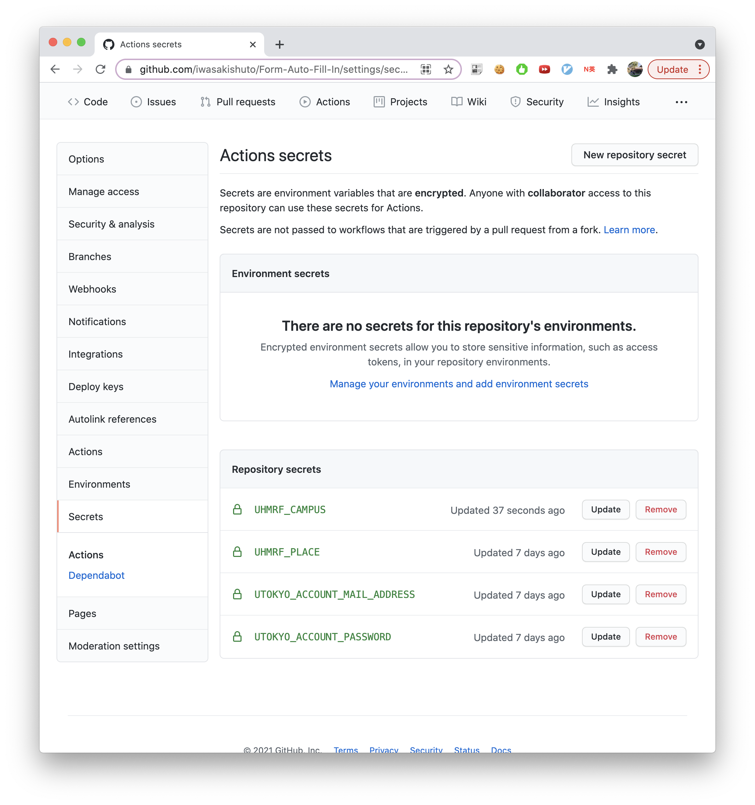

# Form Auto Fill In


[](https://github.com/iwasakishuto/Form-Auto-Fill-In)
[](https://github.com/iwasakishuto/Form-Auto-Fill-In/blob/master/.github/workflows/regular_execution.yml)

Answer Form Automatically. 

## Supported Forms

Currently, the following forms are supported:

- UTokyo Health Management Report Form: https://www.u-tokyo.ac.jp/covid-19/ja/safety/healthcheck.html

## How to use?

The program can be executed by the following two methods, but the former is recommended.

### 1. Automatic Execution with Github Actions

1. Fork this repository
2. <details><summary>Please enable workflow from <b>[Actions]</b> tab.</summary>

    |Understand workflows|Enable [Answer UTokyo Health Management Report Form](https://github.com/iwasakishuto/Form-Auto-Fill-In/blob/master/.github/workflows/regular_execution.yml)|
    |:-:|:-:|
    |||
  </details>

3. <b>[Settings]</b> -> <b>[Secrets]</b> -> <b>[New repository secret]</b> to fill in the required information below.

|Name|Value (example)|description|
|:-:|:-|:-|
|`UHMRF_CAMPUS`|Enter `1,3` for "Hongo Area Campuses" and "Kashiwa Area Campuses"|1.Hongo Area Campuses<br>2.Komaba Area Campuses<br>3.Kashiwa Area Campuses<br>4.Other Campus|
|`UHMRF_PLACE`|ex. 理学部3号館|**Main place(s) you will be staying at or visiting on campus todayImmersive Reader**. Please enter the name(s) and floor(s) of the building(s) you will be staying at or visiting as listed on the campus map on the UTokyo website ( https://www.u-tokyo.ac.jp/en/about/access.html ).|
|`UTOKYO_ACCOUNT_MAIL_ADDRESS`|`XXX@utac.u-tokyo.ac.jp`|Email Address required to access [UTokyo Health Management Report Form](https://www.u-tokyo.ac.jp/covid-19/ja/safety/healthcheck.html)|
|`UTOKYO_ACCOUNT_PASSWORD`|PASSWORD|Password required to access [UTokyo Health Management Report Form](https://www.u-tokyo.ac.jp/covid-19/ja/safety/healthcheck.html)|

<details>
	<summary>Results</summary>


</details>

**Now, Github Actions will run daily at 5 am (JST) :)**

### 2. Install in your Local Env

You can also install it in your own environment and run it as appropriate.

#### Installation

Build the environment with [pyenv](https://github.com/pyenv/pyenv) and [poetry](https://github.com/python-poetry/poetry).

```sh
$ git clone https://github.com/iwasakishuto/Form-Auto-Fill-In.git
$ cd Form-Auto-Fill-In
$ pyenv install 3.8.9
$ pyenv local 3.8.9
$ python -V
Python 3.8.9
$ poetry install
```

#### Run

Execute the following command on terminal. (command prompt)

```sh
$ poetry run answer-UHMRF -P "UHMRF_PLACE=<PLACE>" \
                          -P "UTOKYO_ACCOUNT_MAIL_ADDRESS=<ADDRESS>" \
                          -P "UTOKYO_ACCOUNT_PASSWORD=<PASSWORD>"
[START LOGIN]
Succeeded to locate element with xpath=//input[@type='email']
Succeeded to fill <ADDRESS> in element with xpath=//input[@type='email']
Succeeded to locate element with xpath=//input[@type='submit']
Succeeded to click the element with xpath=//input[@type='submit']
Succeeded to locate element with id=passwordInput
Succeeded to fill <PASSWORD> in element with id=passwordInput
Succeeded to locate element with id=submitButton
Succeeded to click the element with id=submitButton
Succeeded to locate element with xpath=//input[@type='submit']
Succeeded to click the element with xpath=//input[@type='submit']
[END LOGIN]
[START ANSWERING FORM]
[START FORM]
1.
メール送信先
【ECCSクラウドメール(共通ID@g.ecc.u-tokyo.ac.jp)宛の送信にはアドレスの入力は不要です。その他のアドレスへの送信を希望する場合はメールアドレスを入力してください。UTokyoアカウント[共通ID@utac.u-tokyo.ac.jp] はメールアドレスではありませんのでご注意ください）】
※ECCSクラウドメールを利用したことがない方は下記URLからアカウント利用の初期設定をしてください（初期設定時のパスワード変更には最大1時間かかります）。 https://hwb.ecc.u-tokyo.ac.jp/wp/literacy/email/initialize/

	1 [radio] ECCSクラウドメール(共通ID@g.ecc.u-tokyo.ac.jp)宛に送信
	2 [radio] on
	3 [text]
------------------------------
2.
Campus entry
[Check the campus(es) you are going to enter today (where applicable).]

	1 [checkbox] 本郷地区／Hongo Area
	2 [checkbox] 駒場Ⅱ地区／KomabaⅡ Area
	3 [checkbox] 柏地区／Kashiwa Area
	4 [checkbox] その他／Other Campus
------------------------------
3.
Main place(s) you will be staying at or visiting on campus today
Please enter the name(s) and floor(s) of the building(s) you will be staying at or visiting as listed on the campus map on the UTokyo website ( https://www.u-tokyo.ac.jp/en/about/access.html ).

	1 [text]
------------------------------
4.
Body temperature (morning)

	1 [radio] 37.0度未満／Less than 37.0 degrees Celsius
	2 [radio] 37.0度以上37.5度未満／Less than 37.5 degrees Celsius
	3 [radio] 37.5度以上／37.5 degrees Celsius or more
------------------------------
5.
Presence or absence of symptoms
Please answer regarding the presence of symptoms today and during the past week.
If you select "Yes", please answer in detail about the presence or absence of individual symptoms.

(1) Recent breathing difficulties:
heavy breathing (respiratory rate increased), sudden breathing difficulty, short of breath when you move a little, chest pain, not able to breathe unless you sit down or lie down, gasping for breath, or wheezing
(2) Recent taste and smell disorders (no sense of smell or taste)
(3) Recent coughing and sputum/phlegm (severe cough or sputum/phlegm)
(4) Recent general malaise
(5) Nausea
(6) Diarrhea
(7) Others:
no appetite, nasal discharge, nasal congestion, sore throat, headache, joint pain, muscle pain, poor condition all day, body rash, red eye, a large amount of eye discharge, etc.

	1 [radio] はい／Yes
	2 [radio] いいえ／No
------------------------------
[END FORM]
Succeeded to locate element with css selector=button.__submit-button__
Succeeded to click the element with css selector=button.__submit-button__
[END ANSWERING FORM]
```